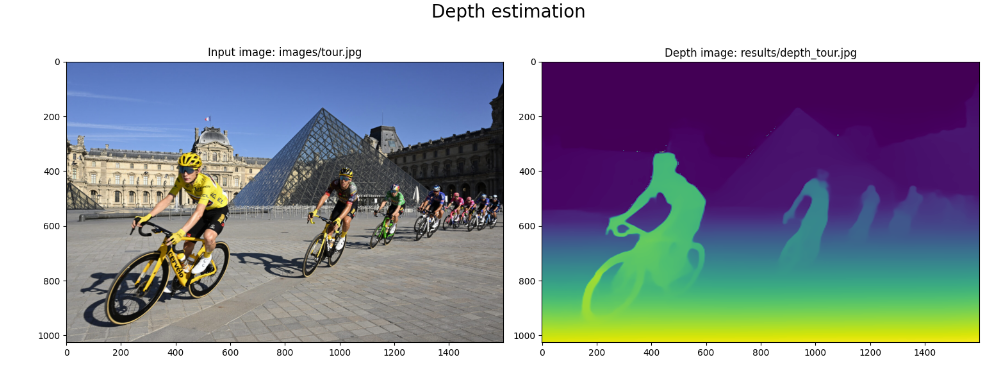
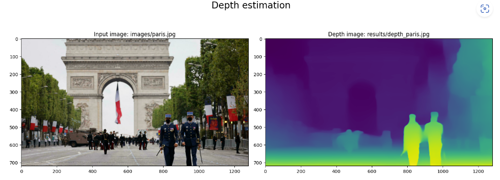
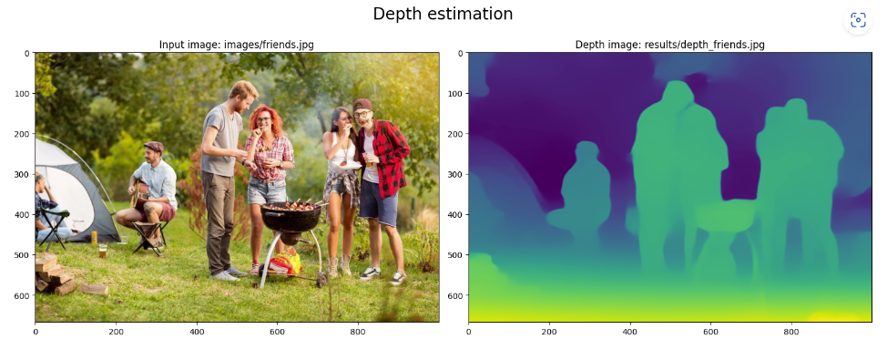

# Depth estimation with Python

## Notebooks
<a href="Depth estimation.ipynb">Depth estimation notebook</a>

## Examples

26-July-2023

Serge Retkowsky | serge.retkowsky@microsoft.com | https://www.linkedin.com/in/serger/

